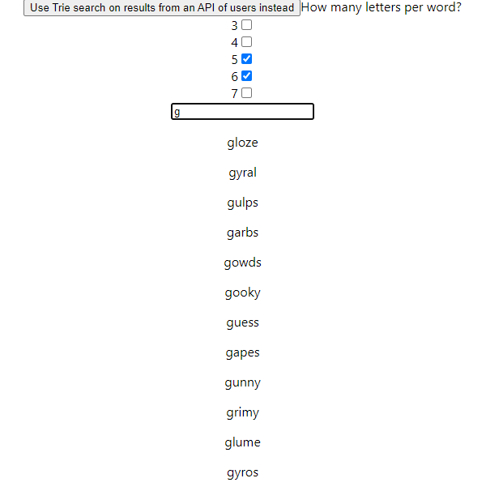
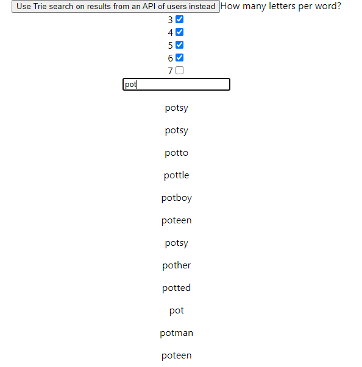

# Trie Data Structure Search

This is my implementation of a trie data strucutre which, from the root node, can take in an array of words and can build a trie out of them, allowing the user to search the tree by prefix. In this implementation I have loaded in a large amount of valid scrabble word data (words with 3, 4, 5, 6, and 7 letters) and, given the users discretion on letter counts used, the trie structure is built from these words and the user can search in an input bar with a prefix of any word to have their corresponding matching words showup in a dynamic list. The user can also choose to use this feature on a set of data retrieved from a public API which returns a handful of names to run the trie search over. The project was to experiment with intensive algorithms with Javascript on the client side. There is minimal styling in the application, where the main focus is the interactions between buttons and results.

The creation of this application was in an attempt show my understanding of react by using multiple components, a router with useHistory and switches, conditional rendering, spreading and destructing, API calls using promises, react hooks, and state management.

The trie algorithm is implemented in the Trie.js file in the config folder.

